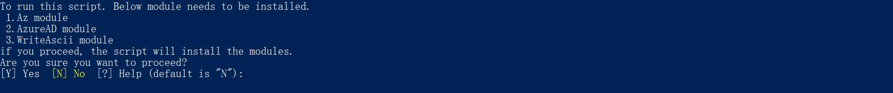

# Prerequisites

To begin, you will need:

- An Azure subscription where you can create the following kinds of resources:
  - App Service
  - App Service Plan
  - Azure Cosmos DB account
  - Bot Channels Registration
  - Application Insights
  - Azure Function
  - Azure SignalR service
  - Azure Key Vault
- A copy of the Ask Away app GitHub [repo](https://github.com/OfficeDev/microsoft-teams-apps-askaway)

# App Deployment

The aplication can be deployed either by using the powershell script, or following the manual deployment guide.
Both the methods are explained in detail below.

## Powershell Script Deployment Guide

### Prerequisites

- [Azure CLI](https://docs.microsoft.com/en-us/cli/azure/install-azure-cli?view=azure-cli-latest)
- Install required modules - Az, AzureAD, WriteAscii
  - `Install-Module Az -AllowClobber -Scope CurrentUser`
  - `Install-Module AzureAD -Scope CurrentUser -Force`
  - `Install-Module WriteAscii -Scope CurrentUser -Force`
- Bypass execution policy for the current powershell session<br/>
  `Set-ExecutionPolicy -Scope Process -ExecutionPolicy Bypass`
- Install jq.<br/>
  Check if jq is already installed in your machine using `jq --version`.<br/>
  If it is not installed, execute the following steps.<br/>
  - Check if chocolatey is already installed in your machine using `choco -?`<br/>
    If not installed, run `Set-ExecutionPolicy Bypass -Scope Process -Force; iex ((New-Object System.Net.WebClient).DownloadString('https://chocolatey.org/install.ps1'))`
  - Install jq using `choco install jq`

### Run the deployment script

1. In your local machine, clone the git [repository](https://github.com/OfficeDev/microsoft-teams-apps-askaway). <br/>
   `git clone https://github.com/OfficeDev/microsoft-teams-apps-askaway.git`
2. Open a PowerShell window in administrator mode and navigate to the deloyment folder.<br/>
   `cd .\microsoft-teams-apps-askaway\deployment\`
3. You will find a paramters.json file under Deployment folder. Please fill in all the `<<value>>` in `paramters.json` appropriately. Make sure you review the default values for optional fields.
   
4. You may refer to the following:
   - `subscriptionId` - Azure subscription to deploy the solution to (MUST be associated with the Azure AD of the Office 365 tenant that you wish to deploy this solution to.) e.g. 22f602c4-1b8f-46df-8b73-45d7bdfbf58e.
   - `subscriptionTenantId` - Id of the tenant to deploy to (If you are not sure how to get Tenant ID, please check Azure Active Directory in Azure Portal. Under Manage, click Properties. The tenant ID is shown in the Directory ID box). e.g 98f3ece2-3a5a-428b-aa4f-4c41b3f6eef0. Tenant ID is also available in the Overview section".
   - `resourceGroupName` - Name for a new resource group to deploy the solution to - the script will create this resource group. e.g. AskAwayRG.
   - `region` - Azure region in which to create the resources. The internal name should be used e.g. eastus. Run the following command in Powershell to list internal names.
     ```
     az account list-locations -o table
     ```
   - `baseResourceName` - which the template uses to generate names for the other resources.
     - The [Base Resource Name] must be available. For example, if you select contosoAskAway as the base name, the name contosoAskAway must be available (not taken); otherwise, it will prompt you to confirmation dialog to update the existing resources.
     - [Base Resource Name] -function etc.
   - `tenantId` - Tenant Id where the teams application will be installed. If the Azure subscription is in the same tenant, copy `subscriptionTenantId` parameter value.
     > **Note**: If your Azure subscription is in a different tenant than the tenant where you want to install the Teams App, please update the Tenant Id field with the tenant where you want to install the Teams App.
   - `customDomainOption` - How the app will be hosted on a domain that is not \*.azurewebsites.net. Azure Front Door is an easy option that the template can set up automatically, but it comes with ongoing monthly costs.
     > **NOTE**: If you plan to use a custom domain name instead of relying on Azure Front Door, read the instructions [here](https://github.com/OfficeDev/microsoft-teams-company-communicator-app/wiki/Custom-domain-option) first.
   - `hostingPlanSku`: The pricing tier for the hosting plan. Defaul value: Standard. You may choose between Basic, Standard and Premium.
   - `hostingPlanSize`: The size of the hosting plan (small - 1, medium - 2, or large - 3). Default value: 1
   - `appDisplayName` - The app (and bot) display name. Default value: AskAway.
   - `appDescription` - The app (and bot) description. Default value: "Ask Away helps QnA hosts and attendees manage and interact with ​QnA sessions.".
   - `appIconUrl` - The link to the icon for the app. It must resolve to a PNG file. Default value [https://raw.githubusercontent.com/OfficeDev/microsoft-teams-apps-askaway/master/Manifest/color.png](https://raw.githubusercontent.com/OfficeDev/microsoft-teams-apps-askaway/master/Manifest/color.png).
   - `companyName` - The display name for the company.
   - `websiteUrl` - The https:// URL to you company's website. This link should take users to your company or product-specific landing page.
   - `privacyUrl` - The https:// URL to the company's privacy policy.
   - `termsOfUseUrl` - The https:// URL to the company's terms of use.
5. Execute the `deploy.ps1` script in the Powershell window: <br/>
   `.\deploy.ps1`

6. If the Azure CLI is not installed, it will prompt you to confirmation dialog to install azure CLI. Enter `Y` to proceed.
   

   > **Note** : Restart the Powershell after Azure CLI is installed. The script will automatically **exit** just after CLI application installation. It will ask you to open a new session and re-run the script.

7. If the azure CLI application is already installed, the script will check if the following modules are installed.
   

   > Note: The script requires Azure CLI `v.2.2` or later. The script will install Azure CLI if its not already installed. If it is already installed, make sure its `v2.2` or later.

8. The script will prompt _twice_ for authentication during execution, once to get access to the Azure subscription, and the other to get access to Azure Active Directory. Please login using an account that has **contributor** role or higher.
   
   

9. The script will next validate if the Azure resources exists in the selected region and if the resources names are available. If resources with same name already exist, the script will show a confirmation box asking it should update the existing resources. Enter `Y` to proceed.
   

10. When the script is completed a DEPLOYMENT SUCCEEDED message will be displayed and the script will open the folder that contains the app packages (zip files).

11. The script will finally generate zip file for the application.
    

## Manual Deployment Guide

### Step 1: Register Azure Active Directory application

Register an Azure AD application in your tenant’s directory for the bot.

1. Open the Azure Active Directory panel in the Azure portal. If you are not in the correct tenant, click Switch directory to switch to the correct tenant. (For instructions on creating a tenant, see Access the portal and create a tenant.)
1. Open the App Registrations panel.
1. In the App Registrations panel, click New Registration.
1. Fill in the required fields and create the App Registration.

   - Name your application - if you are following the template for a default deployment, we recommend "Ask Away".
   - Select the Supported account type as Accounts in any organizational directory.
   - Leave the "Redirect URI" field blank for now.

     

1. Click Register.
1. Once it is created, Azure displays the Overview page for the app.

   - Record the Application (client) ID value. You will use this value later as the Client ID when you register your Microsoft Azure Active Directory application with your bot.
   - Also record the Directory (tenant) ID value. You will also use this to register this application with your bot.
   - Verify that the "Supported account types" is set to Multiple organizations.

   

1. In the navigation pane, click Certificates & secrets to create a secret for your application.
1. Under Client secrets, click New client secret.
1. Add a description to identify this secret from others you might need to create for this app, such as bot login.
1. Set Expires to Never.
1. Click Add.
1. Before leaving this page, record the secret. You will use this value later as the Client secret when you register your Microsoft Azure Active Directory application with your bot. You now have an application registered in Microsoft Azure Active Directory.
1. At this point, you will have:
   - Application id (this will be later used to register as bot id during ARM deployment)
   - Client secret
   - Tenant id

### Step 2: Deploy to your Azure subscription

1. Click on the "Deploy to Azure" button below.

   [](https://portal.azure.com/#create/Microsoft.Template/uri/https%3A%2F%2Fraw.githubusercontent.com%2FOfficeDev%2Fmicrosoft-teams-apps-askaway%2Fmaster%2Fdeployment%2Fazuredeploy.json)

1. When prompted, log in to your Azure subscription.
1. Azure will create a "Custom deployment" based on the ARM template and ask you to fill in the template parameters. Please ensure that you don't use underscore (\_) or spaces in any of the field values otherwise the deployment may fail.
1. Select a subscription and resource group.
   - We recommend creating a new resource group.
   - The resource group location MUST be in a datacenter that supports: Application Insights, App Service, and Azure Cosmos DB. For an up-to-date list, click here, and select a region where the following services are available:
   - Application Insights
   - App Service
   - Azure Cosmos DB
   - Azure Function
   - Azure SignalR service
   - Azure Key Vault
   - Remember the resource group name and subscription id of the subscription that you selected. We will need it later.
1. Enter a "Base Resource Name", which the template uses to generate names for the other resources.
   - The app service name [Base Resource Name] must be available. For example, if you select “askaway” as the base name, the name “askaway” must be available (not taken); otherwise, the deployment will fail with a Conflict error.
   - Remember the base resource name that you selected. We will need it later.
1. Fill in the various IDs in the template:
   - Bot client ID: The application (client) ID of the Microsoft Teams bot app
   - Bot client secret: The client secret of the Microsoft Teams bot app
     Make sure that the values are copied as-is, with no extra spaces. The template checks that GUIDs are exactly 36 characters.
1. If you wish to change the app name, description, and icon from the defaults, modify the corresponding template parameters.
1. Agree to the Azure terms and conditions by clicking on the check box "I agree to the terms and conditions stated above" located at the bottom of the page.
1. Click on "Purchase" to start the deployment.
1. Wait for the deployment to finish. You can check the progress of the deployment from the "Notifications" pane of the Azure Portal. It can take up to an hour for the deployment to finish.
1. Once the deployment has finished, you would be directed to a page that has the following fields:
   - BotId - This is the Microsoft Application ID for Ask Away.
   - AppDomain - This is the base domain for Ask Away.
     Remember the AppDomain value. We will need it later.

### Step 3: Build the app locally.

Build the AskAway application locally using the build script.

1. In your local machine, clone the git [repository](https://github.com/OfficeDev/microsoft-teams-apps-askaway). <br/>
   `git clone https://github.com/OfficeDev/microsoft-teams-apps-askaway.git`
2. Navigate to the deloyment folder.<br/>
   `cd .\microsoft-teams-apps-askaway\deployment\`
3. Run following command.
   `Set-ExecutionPolicy -Scope Process -ExecutionPolicy Bypass`
4. Run the build script. This operation may take a while to complete.<br/>
   `.\build.ps1`

### Step 4: Zip Deployment

1. Note the _Base Resource Name_ and _Resource Group Name_ from Step 2.
2. Please find subscription Id corresponding to your azure subscription.
3. Run the following command and login using account which has access to Azure subscription. <br/>
   `az login`
4. Run the zip deployment script. This operation may take a while to commplete. <br/>
   `.\zipDeploy.ps1 <base_resource_name> <resource_group_name> <subdcription_id>`

### Step 5: Setup Authentication

1. Note the _Appplication Id_ from Step 1 and _AppDomain_ from Step 2.
2. Go to App Registartion panel and open the app that you created in Step 1.
3. Under **Manage**, click on **Expose an API**.

   1. Click on the **Set** link next to **Application ID URI**, and change the value to `api://<app_domain>/<application_id>` eg: `api://appName.azurefd.net/934d17fb-600d-4a90-8340-40599fb5ddce`
   2. Click **Save** to commit your changes.
   3. Click on **Add a scope**, under **Scopes** defined by this API. In the flyout that appears, enter the following values:
      - **Scope name**: access_as_user
      - **Who can consent?**: Admins and users
      - **Admin and user consent display name**: Access the API as the current logged-in user
      - **Admin and user consent description**: Access the API as the current logged-in user
   4. Click **Add scope** to commit your changes.
   5. Click Add a client application, under Authorized client applications. In the flyout that appears, enter the following values:
      - **Client ID**: 5e3ce6c0-2b1f-4285-8d4b-75ee78787346
      - **Authorized scopes**: Select the scope that ends with access_as_user. (There should only be 1 scope in this list.)
   6. Click **Add** application to commit your changes.
   7. Repeat the previous two steps, but with client ID = 1fec8e78-bce4-4aaf-ab1b-5451cc387264. <br/>After this step you should have two client applications (5e3ce6c0-2b1f-4285-8d4b-75ee78787346 and 1fec8e78-bce4-4aaf-ab1b-5451cc387264) listed under Authorized client applications.

   

4. Under **Manage**, click on **API permissions** blade from the left hand side.

   1. Click on **Add a permission** button to add permission to your app.
   2. In Microsoft APIs under Select an API label, select the particular service and give the following permissions,
      - Under Commonly used Microsoft APIs,
      - Select **Microsoft Graph**, then select Delegated permissions and check the following permissions,
        - openid
      - Click on Add Permissions to commit your changes.
   3. If you are logged in as the Global Administrator, click on the “Grant admin consent for %tenant-name%” button to grant admin consent, else inform your Admin to do the same through the portal. Alternatively you may follow the steps below:
      - Prepare link - https://login.microsoftonline.com/common/adminconsent?client_id=%appId%. Replace the %appId% with _Appplication Id_ (step 1).
      - Global Administrator can grant consent using the link above.

   
   

5. Under **Manage**, click on **Authentication** to bring up authentication settings.
   1. Add a new entry to Redirect URIs:
      - Type: Web
      - Redirect URI: Enter `https://%appDomain%/askAwayTab/signInSimpleEnd.html` for the URL e.g. `https://appName.azurefd.net/askAwayTab/signInSimpleEnd.html`
   2. Under Implicit grant, check **ID tokens**.
   3. Click **Save** to commit your changes.

### Step 6: Create the Teams app packages

Create Teams app package:

1. Open the Manifest\manifest.json file in a text editor.
1. Change the placeholder fields in the manifest to values appropriate for your organization.
   - developer.name
   - developer.websiteUrl
   - developer.privacyUrl
   - developer.termsOfUseUrl
1. Replace {{MicrosoftAppId}} placeholder to your Azure Active Directory application's ID from above. This is the same GUID that you entered in the template under "Bot Client ID".
1. Replace {{HostName}} placeholder to `[BaseResourceName].azurefd.net`. (e.g. https://askaway.azurefd.net)
1. Create a ZIP package with the manifest.json,color.png, and outline.png. The two image files are the icons for your app in Teams.
   - Name this package askaway.zip.
   - Make sure that the 3 files are the top level of the ZIP package, with no nested folders.

### Step 7: Run the apps in Microsoft Teams

1. If your tenant has sideloading apps enabled, you can install your app by following the instructions [here](https://docs.microsoft.com/en-us/microsoftteams/platform/concepts/deploy-and-publish/apps-upload#load-your-package-into-teams).
2. You can also upload it to your tenant's app catalog, so that it can be available for everyone in your tenant to install. See [here](https://docs.microsoft.com/en-us/MicrosoftTeams/manage-apps).

### Troubleshooting

Please see our [Troubleshooting](Troubleshooting.md) page.
