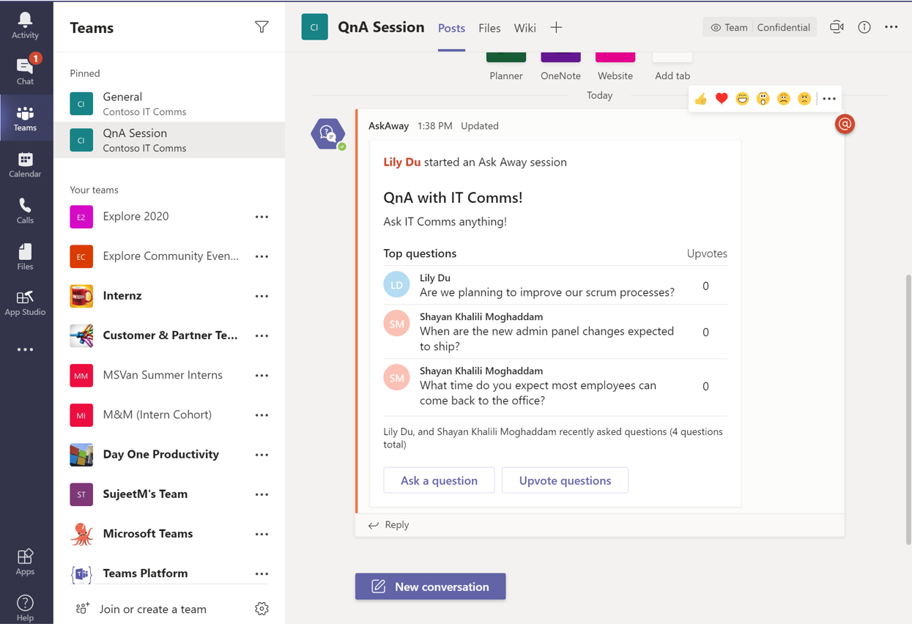
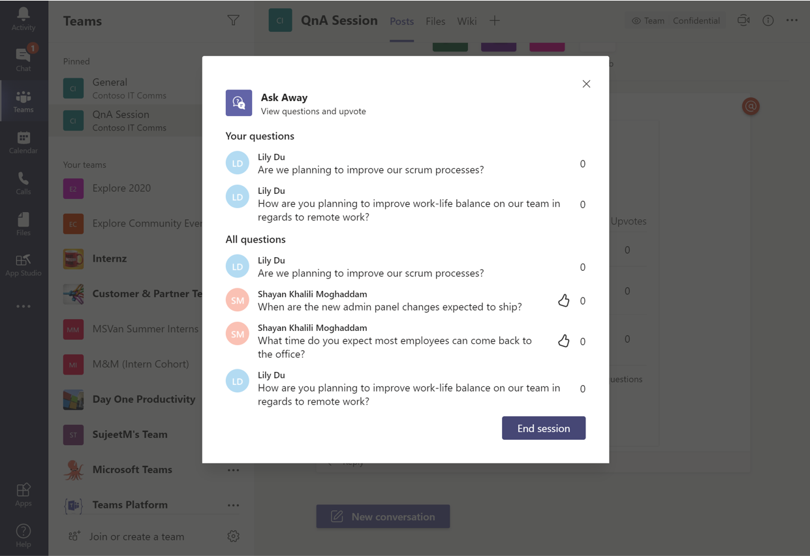

### Welcome to the Ask Away app template wiki!

As organizations rely more on Teams to collaborate and do work, there is a need to connect organization leaders and SMEs (Subject Matter Experts) with their team members to share organizational updates and knowledge. With the onset of COVID-19, even more teams are conducting Q&A (Question and Answer) sessions remotely using Teams. Orchestrating one of these sessions directly in a Teams channel or chat is messy because hosts do not have a way to track questions and attendees do not have a way to upvote questions. Making it easier to conduct one of these sessions will add value to Teams and make it easier for users to collaborate and share knowledge.

The Ask Away app helps Q & A hosts easily gather questions for a Q & A event from within a Teams channel or chat. Team members can submit questions and upvote others shared by colleagues, resulting in a list of top-of-mind questions to give to the Q & A host. Because the bot runs in Teams, organizations can use it to conduct real-time sessions.

**Key features:**

With the Ask Away app in Microsoft Teams, attendees can:

- Submit questions.
- Upvote questions shared by colleagues.
- View a summary of top questions and general session updates on the main card.
- View all questions and associated upvote counts, with personally asked and top questions organized in the leaderboard.

Hosts can use the Ask Away app to:

- Start, manage, and end Q & A events.
- View a summary of top questions and general session updates on the main card.
- View all questions and associated upvote counts, with personally asked and top questions organized in the leaderboard

The app workflow is described below:

1. The host initiates a new Q & A event in a Teams channel or chat along with a live Teams call.
1. Attendees in the channel or chat submit questions during the duration of the event.
1. Everyone can view the leaderboard which organizes all the questions asked along with associated upvote counts.
1. Hosts will answer the questions submitted throughout the event through the Teams call.
1. Everyone can upvote questions in the leaderboard.
1. Everyone can view the top questions and general session updates on the main card.
1. Hosts will end the Q & A session once the event is complete.

Here is an example screenshot of the main card:

Screenshot of the leaderboard pop up box to vote on questions:

