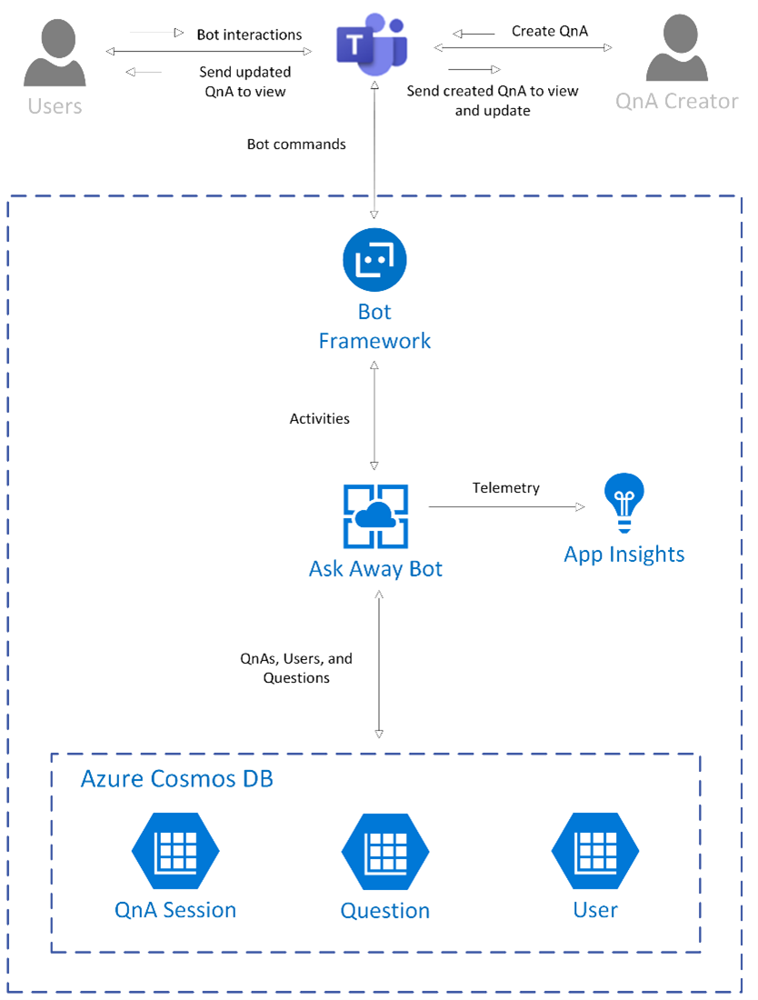

**Bot Application**
This is a web application built using the Bot Framework SDK v4 for Node.js. Ask Away is a bot that helps you easily gather questions for a Q & A event from within a Teams channel and chat.
**Azure solution**

- The app service implements the bot and messaging extension experience by providing end points for user communication. User can start/end a Q & A, submit/upvote questions for an active Q & A, and view the leaderboard.
- App endpoint is registered as the messaging endpoint in Bot Registration portal and provides an endpoint /api/messages to process bot and messaging extension requests/response.

**Azure bot service:** Azure bot service is developed using BOT SDK v4. Ask Away app endpoint is registered as messaging end point in bot registration portal.

**Azure Cosmos DB with MongoDB API:** Azure Cosmos DB is used to store Q & A session, user and question information. Details are provided in [Data stores](Data-Stores.md) section.

**Application Insights:** Application insights is used for tracking exceptions. Details are provided in [Telemetry](Telemetry.md) section.

**Data stores:** The web app is using Azure Cosmos DB for data storage due to its cost-effective pricing model and providing support for No-SQL data models.
