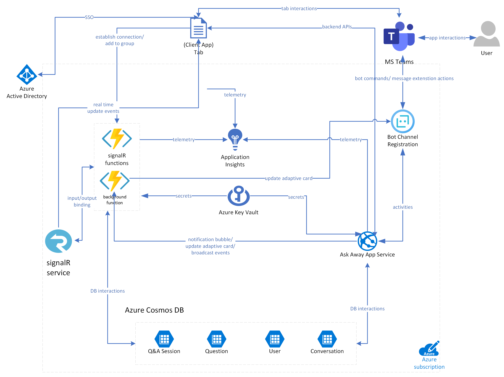
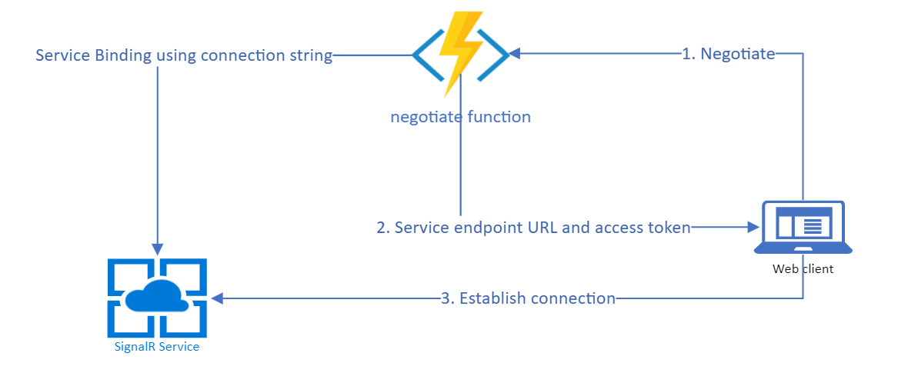
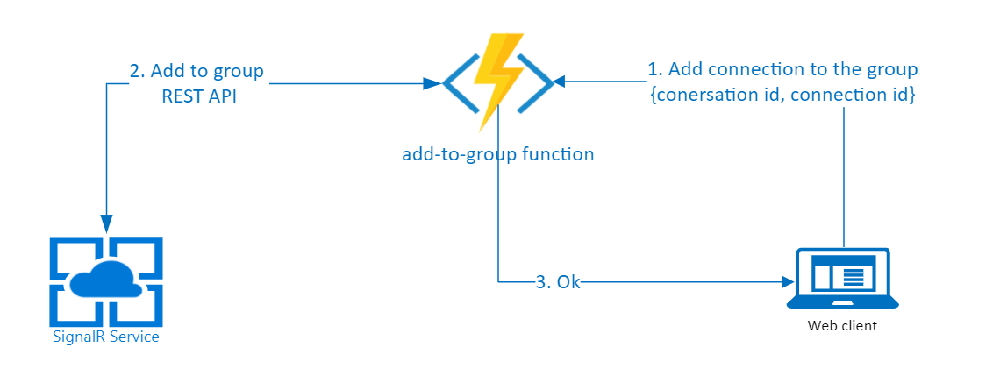
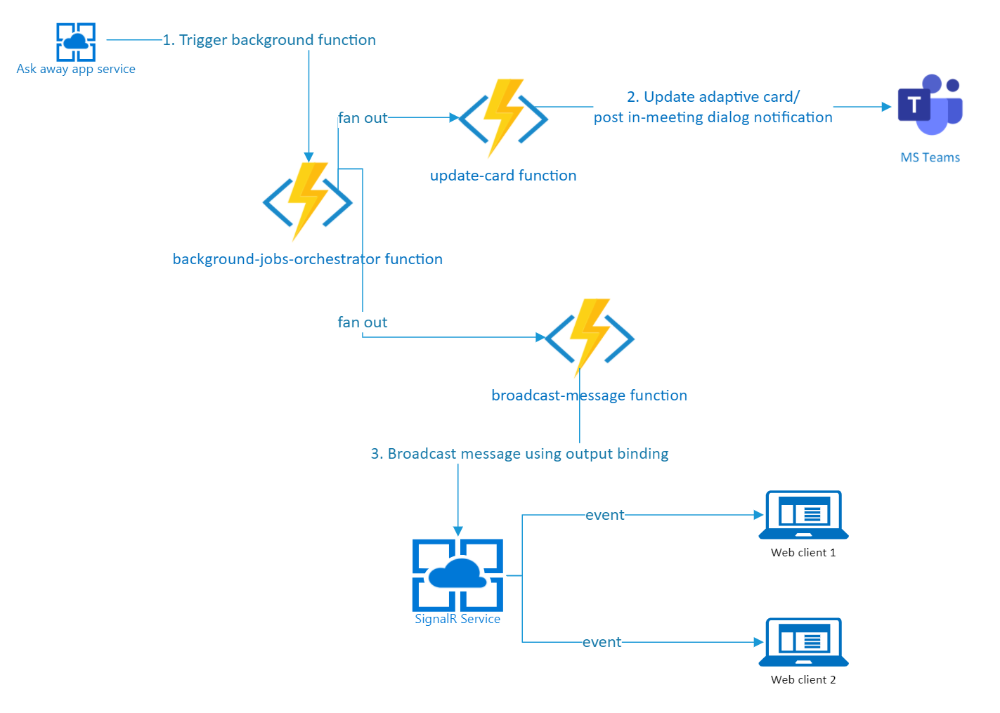

Refer the following image for high level architecture.

The **Ask Away** app has the following main components:

- **App Service**: The app service implements the messaging endpoint for the bot/messaging extension and client app that powers tab application.
- **Azure Function**: The Azure Functions are used for negotiating SignalR connection. They also perform background jobs that post/update adaptive card, trigger in-meeting dialog notification and broadcast events to clients.
- **Azure SignalR Service**: The Azure SignalR service powers real-time updates for **Ask Away** client app. Please find more information about Azure SignalR service [here](https://docs.microsoft.com/en-us/azure/azure-signalr/signalr-overview).

---

## App Service

The app service implements two main components: the tab that hosts meeting experience, and web APIs.

### Ask Away tab

The Ask Away tab hosts pre/post meeting and in-meeting experience, that enables creating/ending a Q & A session, posting/upvoting questions and marking them as answered.

The tab is implemented as a React application, using UI components from [Fluent UI Web](https://github.com/microsoft/fluentui).

The tab's front-end gets its data from web APIs implemented by the same app service that's hosting it.

The tab app establishes a SignalR connection which provides real time updates for an on-going Q & A session.

### Ask Away APIs

The Ask Away web APIs provides the messaging endpoint for the bot and REST endpoints to serve the tab app.

1. Bot endpoint

   The app service exposes a bot messaging endpoint (`api/messages`), which receives activities from Bot Framework when a user installs/uninstalls the application and interacts with messaging extension and cards posted by the app.

   The bot/messaging extension experience to create/end a Q & A session, post/upvote questions is powered by app service's bot messaging endpoint.

2. Web APIs

   The app service exposes APIs to cater data to Ask Away tab. These APIs are protected by AAD SSO token authentication, which checks that the user attempting to access it is from the correct organization and is a participant of the meeting.
   Following is the list of exposed REST APIs.

   | Sr. No. | Use Case                                                          | API                                                                               | Input                                                                                                                                                       | Output                                                                                                                                                                                                                                                                                                                  |
   | ------- | ----------------------------------------------------------------- | --------------------------------------------------------------------------------- | ----------------------------------------------------------------------------------------------------------------------------------------------------------- | ----------------------------------------------------------------------------------------------------------------------------------------------------------------------------------------------------------------------------------------------------------------------------------------------------------------------- |
   | 1.      | Provides a list of all ama sessions for given conversationId      | GET conversations/{conversationId}/sessions                                       | 1] conversationId – path                                                                                                                                    | 1] 200 OK - list of sessions   2] 500 Error (internal server error)   3] 401 Unauthorized (if user is not from the correct organization)  4] 403 Forbidden (if conversation does not belong to meeting/ user is not part of conversation)                                                                   |
   | 2.      | Provides details of given sessionId                               | GET conversations/{conversationId}/sessions/{sessionId}                           | 1] conversationId – path   2] sessionId - path                                                                                                          | 1] 200 OK - session   2] 500 Error (internal server error)   3] 401 Unauthorized (if user is not from the correct organization)  4] 403 Forbidden (if conversation does not belong to meeting/ user is not part of conversation)                                                                            |
   | 3.      | Provides list of all active ama sessions for given conversationId | GET conversations/{conversationId}/activesessions                                 | 1] conversationId – path                                                                                                                                    | 1] 200 OK - list of active sessions   2] 500 Error (internal server error)   3] 401 Unauthorized (if user is not from the correct organization)  4] 403 Forbidden (if conversation does not belong to meeting/ user is not part of conversation)                                                            |
   | 4.      | Creates a session                                                 | POST conversations/{conversationId}/sessions                                      | 1] conversationId – path   2] title - body   3] description - body 4] scopeId - body (chat id)                                                      | 1] 201 Created - session   2] 500 Error (internal server error)   3] 401 Unauthorized (if user is not from the correct organization)  4] 403 Forbidden (if conversation does not belong to meeting/ user is not part of conversation)   400 Bad Request (any of the body parameter is missing/invalid)  |
   | 5.      | Updates a session                                                 | PATCH conversations/{conversationId}/sessions/{sessionId}                         | 1] conversationId – path   2] sessionId - path   3] action – body (allowed values ['end'])                                                          | 1] 204 No Content   2] 500 Error (internal server error)   3] 401 Unauthorized (if user is not from the correct organization)  4] 403 Forbidden (if conversation does not belong to meeting/ user is not part of conversation)   400 Bad Request (any of the body parameter is missing/invalid)         |
   | 6.      | Posts a question                                                  | POST conversations/{conversationId}/sessions/{sessionId}/questions                | 1] conversationId – path   2] sessionId - path   3] questionContent – body                                                                          | 1] 201 Created - question   2] 500 Error (internal server error)   3] 401 Unauthorized (if user is not from the correct organization)  4] 403 Forbidden (if conversation does not belong to meeting/ user is not part of conversation)   400 Bad Request (any of the body parameter is missing/invalid) |
   | 7.      | Updates a question                                                | PATCH conversations/{conversationId}/sessions/{sessionId} /questions/{questionId} | 1] conversationId – path   2] sessionId - path   3] questionId – path   4] action – body (allowed values ['upvote','downvote', 'markAnswered']) | 1] 200 Ok - question   2] 500 Error (internal server error)   3] 401 Unauthorized (if user is not from the correct organization)  4] 403 Forbidden (if conversation does not belong to meeting/ user is not part of conversation)   400 Bad Request (any of the body parameter is missing/invalid)      |
   | 8.      | Provides information of currently logged in user                  | GET conversations/{conversationId}/me                                             | 1] conversationId – path                                                                                                                                | 1] 200 Ok - User information (user role, user name, user aad object id)   2] 500 Error (internal server error)   3] 401 Unauthorized (if user is not from the correct organization)  4] 403 Forbidden (if conversation does not belong to meeting/ user is not part of conversation)                        |

These APIs update Q & A sessions and trigger background job to dispatch this update information to users.

---

## Azure Function

Ask Away app uses four Azure Functions:

### negotiate function

This function is an HTTP triggered Azure Function with SignalRConnectionInfo input binding to generate the connection information object, which is later user by clients to establish SignalR connection.

- This function end point is protected by AAD SSO token authentication.
- Every client establishes SignalR connection when it loads.
- Please learn more about negotiate function [here](https://docs.microsoft.com/en-us/azure/azure-signalr/signalr-concept-serverless-development-config#negotiate-function).

### add-to-group function

This function is an HTTP triggered Azure Function which uses [SignalR REST API](https://docs.microsoft.com/en-us/azure/azure-signalr/signalr-quickstart-rest-api) to add connection to a group.

- Clients which are part of the same meeting are grouped together (with conversation id as a group id).
- This helps broadcasting updates to only relevant clients to power real-time updates to the UI.
- This function end point is protected by AAD SSO token authentication.
- Every client triggers this function to add connection to the right group once successful SignalR connection is established.

#### Azure SignalR REST API used:

| Sr. No. | Use Case                    | API                                                                                                                                                                                                                                | API version |
| ------- | --------------------------- | ---------------------------------------------------------------------------------------------------------------------------------------------------------------------------------------------------------------------------------- | ----------- |
| 1.      | Add a connection to a group | PUT [https://<instance-name>.service.signalr.net/api/v1/hubs/<hub-name>/groups/<group-name>/connections/<connection-id>](https://docs.microsoft.com/en-us/azure/azure-signalr/signalr-quickstart-rest-api#add-connection-to-group) | v1.0        |

### background-jobs-starter

This function is an HTTP triggered Azure Function which triggers background job orchestrator.

- This function is triggered by the **Ask Away App service** whenever there is an update on a Q & A session.
- This function end point is protected by AAD managed identity token authentication so that only **Ask Away App service** can access it.

### background-jobs-orchestrator

This is a [durable function](https://docs.microsoft.com/en-us/azure/azure-functions/durable/durable-functions-overview?tabs=csharp) and is executed by background-jobs-starter function. The function does following:

- **Broadcast** : Broadcasts updates to all the relevant clients to power real-time UX. This is achieved using [SignalR output binding](https://docs.microsoft.com/en-us/azure/azure-functions/functions-bindings-signalr-service-output?tabs=csharp#send-to-a-group).
- **In-meeting dialog notification**: Notifies every participant in the meeting when a new Q & A session is started with an [in-meeting dialog notification](https://docs.microsoft.com/en-us/microsoftteams/platform/apps-in-teams-meetings/create-apps-for-teams-meetings?tabs=javascript#notificationsignal-api).
- **Post/update Q & A session card**: Posts/updates Q & A session card with debounce time of 5 seconds.

#### Some of the designs and data flows related to background job azure function

1. **DB rollback for update operations**
   All Q & A session related operations eg, session creation, posting a new question, updating a question etc are conveyed to all web clients through this background job. The job is also responsible for updating adaptive card. Hence for any reason, if background job trigger fails, we need to roll back the changes as the card won't get updated and clients won't receive updates.

Rollback operation might cause race condition for DB update operations eg: mark question as answered, end ama session, when two users try to perfrom these simultaneously. It could happen that background job is triggered successfully for a user and it fails for another and that flow rolls back the updates.

To handle this race condition, we introduce a temporary lock on session and question documents.

For eg:
We have added `dateTimeMarkAsAnsweredOperationLockAcquired ` field in question document. When a question document isAnswered field is updated, we set above field with current time. The lock stays valid till `MarkQuestionAsAnsweredOperationLockValidityInMS` ms from app setting. We reject next updates on the question documents on isAnswered field if the lock is valid.

Similarly dateTimeEndOperationLockAcquired field and EndSessionOperationLockValidityInMS app setting is used to manage race condition for Q&A session updates.

2. **Adaptive card debounce**
   Adaptive card gets posted for every new Q & A session. This card needs to be updated with current session state. Updating it for every single action might cause flakiness and will be a bad user experience. Hence, we have kept debounce time for card update.

It is set in `MaxWaitTimeForAdaptiveCardRefreshInMs` app setting. We store `dateTimeCardLastUpdated` along with ama session document. Whenever new card update request comes, we check if debounce period has elapsed. If not, we schedule card update activity accordingly and update `dateTimeNextCardUpdateScheduled` field. If yes, we update the card and set `dateTimeCardLastUpdated` field.

If for a new card update, debounce time is not elapsed and future activity is scheduled, we just ignore the update as the scheduled activity will do it any way.

### **Handling orphaned Q & A sessions**

Adaptive card post/update flow is delegated to azure function app. If for a channel and non-meeting group chat, the function app could not post a card for new Q & A session, user won’t be able to access it. Above scenario would not happen for meeting chats as we have tab app through which we can access Q & A sessions.

Hence to avoid persistent orphaned Q&A sessions, we set (time to live) on Q & A session document related to channel/non-meeting chat. When the session gets created from Ask Away service layer, we set the ttl field to `OrphanedAmaSessionExpiryInSeconds` app setting. When we successfully post card from azure function, we set this field to null so that the document will not expire.

Hence, documents for which, card did not get posted will auto expire after ` OrphanedAmaSessionExpiryInSeconds` seconds.

Ttl is set to null for meeting chat Q&A sessions, irrespective of card post.
